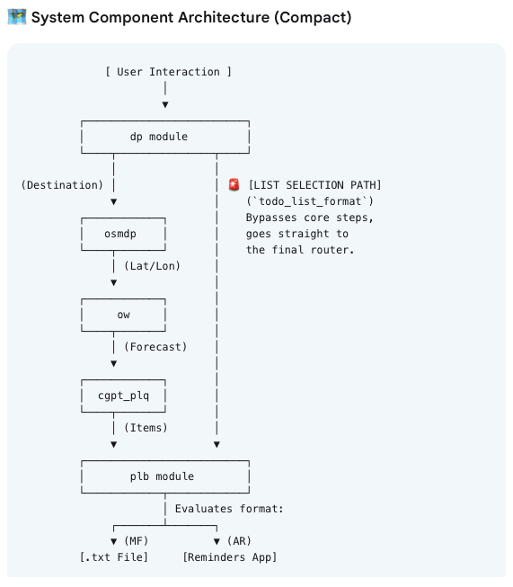
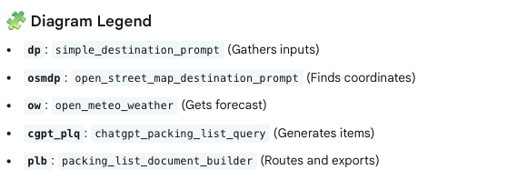
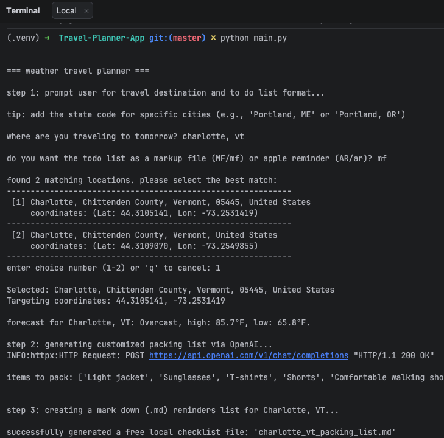
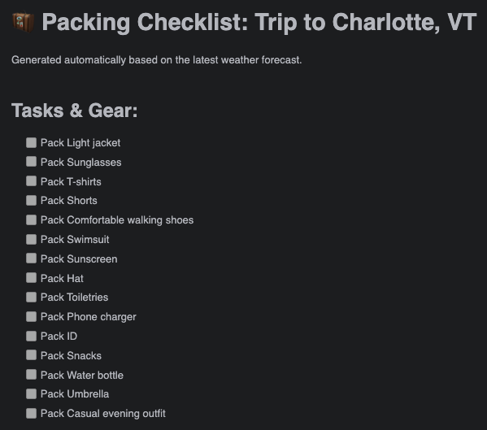

# Travel Planner Application

## This project provides a simple example of Master Tool-Chaining (The Gateway to Workflows)

Automated workflows rely on one tool feeding data directly into another.

The Concept: The GPT calls Tool A, processes the output, and automatically feeds it into Tool B without user intervention.

Practice Project: Create a "Weather Travel Planner." 

When a user says "I'm traveling to Chicago tomorrow," the GPT should:

1. Call your Weather MCP to check the destination forecast.

2. Pass that forecast to a Packing List MCP to auto-generate a custom checklist.

3. Pass the checklist to a to do list creation tool MCP to create a task list for the user.

In this project step 2 is the only step that involves ChatGPT. 

In step 2 a prompt is programmatically sent to OpenAI ChatGPT requesting the generation of a packing list. 

The response (a packing list) is then sent to a tool that generates either a .md file or an Apple Reminder for the user.

## System Component Architecture

## Screenshot of Execution

## Screenshot of .md Packing List

## Screenshot of Apple Reminder Packing List

