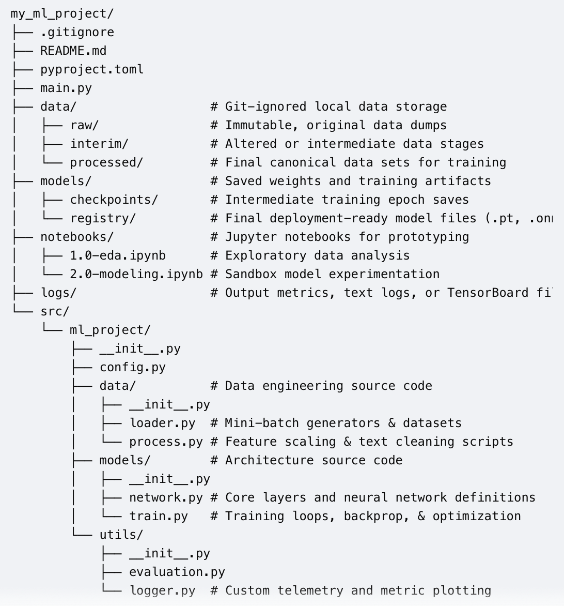

# repository-template
This is a template for machine learning repositions.

# Template Schematic

# .gitkeep files
Git cannot track empty folders. To ensure this entire structure transfers over when you generate a new repository from your template, create an empty hidden file named .gitkeep inside the data/raw/, data/interim/, data/processed/, models/checkpoints/, models/registry/, and logs/ folders.